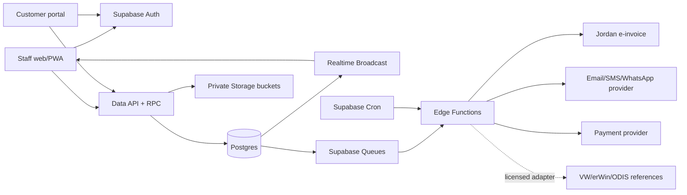
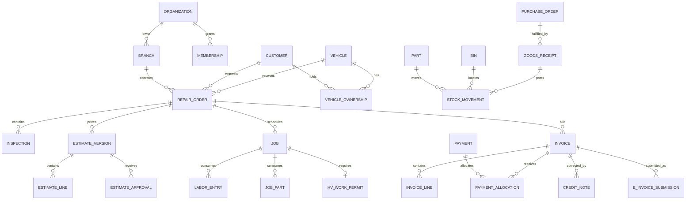

# VW ID EV Service Center Platform

Product and technical specification · Version 1.0 · 3 September 2026

Status: implementation-ready baseline, pending local legal, tax, Volkswagen importer and workshop-safety validation

## 1. Executive specification

Build a bilingual, multi-branch workshop platform for Volkswagen ID electric vehicles. It covers customer and vehicle management, appointments, reception, digital inspections, estimates and customer approval, repair orders, technician work, high-voltage safety controls, parts inventory and purchasing, invoices, payments, credit notes, customer communications, a customer portal and management reporting.

The backend is Supabase: Postgres is the system of record; Auth identifies staff and customers; Row Level Security (RLS) enforces organization, branch and customer boundaries; Storage holds controlled documents and media; Realtime Broadcast updates workshop boards; Edge Functions isolate external integrations and document rendering; Queues provide durable asynchronous jobs; Cron handles reminders and housekeeping.

The design is intentionally not tied to one service schedule or tax rate. Volkswagen says the all-electric ID family in the UK receives an inspection every two years and describes checks covering charging components, battery health, brakes, lighting and tyres. Other first-party material adds pollen filter, brake fluid and software checks. These facts seed a market-specific service-template version; they are not universal rules.[^vw-service] The system must always resolve the applicable template by country, model, model year, VIN applicability and effective date.

Opening a high-voltage battery is permitted only at a capable high-voltage service center and by qualified high-voltage technicians, according to Volkswagen.[^vw-id-service] Accordingly, high-voltage work is a hard authorization workflow, not merely a checklist.

## 2. Product decisions and assumptions

### 2.1 Launch assumptions

- Initial market: Jordan; architecture remains country-configurable.
- Languages: Arabic (RTL) and English (LTR), with translatable catalog and template content.
- Default time zone: `Asia/Amman`; timestamps stored as `timestamptz` in UTC and rendered in the branch time zone.
- Default currency: `JOD`; money stored as `numeric(18,3)`. Currency and decimal scale are configurable.
- Deployment: one Supabase project per environment (`development`, `staging`, `production`), not per branch.
- Tenant: an `organization`; each organization has multiple branches that may operate in different cities, each with its own address, time zone, calendar, capabilities, resources, warehouses and invoice configuration.
- Customers, vehicles and service history are organization-wide by default, allowing a customer to visit any city branch without duplicate records. Operational access remains branch-scoped.
- Business type: independent or importer-authorized specialist. No claim of Volkswagen authorization is made by the software.
- Service information: official procedures remain in licensed Volkswagen systems. This platform records references, results and attachments; it does not copy or redistribute copyrighted repair content.

### 2.2 In scope

- CRM, privacy preferences and customer portal
- Volkswagen ID and other EV-ready vehicle records
- Appointments, capacity and resource scheduling
- Check-in, condition capture and digital vehicle inspection
- Estimates, versions, customer approval and change orders
- Repair orders, jobs, tasks, labor, technician dispatch and quality control
- High-voltage risk triage, permits, qualification gates and battery-health records
- Diagnostic-session metadata and file import
- Parts catalog, stock, reservations, purchasing, receipts, transfers and counts
- Invoices, payments, allocations, refunds and credit notes
- Jordan e-invoicing adapter, configured as a deployment option
- Notifications, audit history, dashboards and exports

### 2.3 Explicitly out of scope for v1

- Full general ledger, payroll and fixed-asset accounting
- Insurance claim adjudication
- Automatic OEM warranty authorization or reimbursement
- Direct control of vehicle ECUs, chargers, lifts or high-voltage tools
- Scraping or reverse-engineering ODIS, erWin, Digital Service Schedule or Volkswagen App
- Telematics ingestion without a contracted interface and explicit customer consent
- Prescribing emergency response, battery repair steps or electrical isolation procedures

## 3. Success metrics

The initial release succeeds when it achieves:

- at least 95% of jobs flowing from appointment/check-in to closed repair order without offline re-entry;
- 100% traceability from every issued part and billed line to its source repair order or approved manual adjustment;
- zero posted invoices edited in place;
- zero high-voltage tasks started without a valid technician qualification and capable branch/bay;
- median estimate approval time and vehicle cycle time measurable by branch, advisor and job type;
- stock variance, gross margin, technician utilization, comeback rate and accounts receivable aging visible from reconciled data;
- complete audit attribution for price overrides, approvals, stock adjustments, invoice posting, refunds and safety overrides.

## 4. Users, roles and authorization

The application has exactly two internal roles. Roles are organization-scoped; branch access is assigned separately. Job functions, capability permissions and technician qualifications are not additional roles.

| Role | Principal capabilities |
|---|---|
| Admin | Full organization and branch administration, staff access, configuration, operational and financial records, reports and integrations. Admin status does not replace a required technical/HV qualification or safety sign-off. |
| Staff | Access only to assigned branches and explicitly granted capability permissions. A Staff user may perform reception, workshop, technician, inventory, invoicing or reporting duties according to those permissions. |

Customer portal identities are stored in `customer_accounts`; they are not members of the internal Admin/Staff role system.

Staff capability examples use action names such as `repair_order.read`, `estimate.override_price`, `hv_permit.authorize`, `stock.adjust`, `invoice.post`, `payment.refund`, and `report.finance.read`. Admin receives all application capabilities by policy. Staff receives only capabilities assigned to its membership. Authorization never trusts user-editable metadata. MFA (`aal2`) is mandatory for Admin and for Staff granted HV authorization, refunds, financial administration or integration management.

Safety rules override business role: neither Admin nor Staff may perform technical/HV work without a valid qualification, capable branch/bay and required permit/sign-offs.

### 4.1 Multi-city branch operating rules

- Every appointment, repair order, job, resource booking, warehouse transaction, invoice, payment and cash session belongs to exactly one operating branch.
- Customer, vehicle, ownership, odometer and service-history records belong to the organization and are reusable across branches. Branch staff see them only when their permissions and the active service relationship allow it.
- A customer chooses a city and branch during booking. Search results show distance when location consent is available, available dates, opening hours, supported services, HV capability and transport options.
- Staff with organization-wide booking permission may book any branch; other Staff users may book only assigned branches.
- A branch may have its own price list, labor rate, tax registration, invoice series, language defaults and payment methods. Organization defaults apply only when a branch override is absent.
- A part may never “move” between cities by editing its bin. Inter-branch transfers use paired transfer-out and transfer-in movements plus an `in_transit` location, dispatch/receipt timestamps and discrepancy handling.
- Work cannot be dispatched to a branch or bay lacking the required service/HV capability. A transfer or referral preserves the original customer concern and creates a linked destination appointment/RO; it does not reassign the original RO.
- Management can report one branch, one city, a region or the full organization using the same reconciled transactional data.

## 5. End-to-end operating model

### 5.1 Service journey

1. The advisor finds or creates the customer and vehicle, verifies ownership/authority and records communication consent.
2. The appointment selects requested services, symptoms, preferred time, transport needs and optional pre-arrival files.
3. Capacity logic reserves an advisor window, qualified technician skill pool, bay class and any specialist equipment.
4. At check-in, the advisor records odometer, state of charge, warning lights, keys, accessories, exterior/interior condition, photos and customer authorization for diagnosis/road test.
5. Risk triage marks the vehicle `normal`, `restricted`, `quarantine`, or `emergency_escalation`. Suspected battery damage blocks normal work and follows the site's approved safety plan. Volkswagen warns that damaged HV batteries can present electrical, toxic-fluid/gas and fire risks.[^vw-safety]
6. The system creates a repair order (RO) and an initial estimate version. Inspection findings generate recommended jobs with severity, evidence and deferral options.
7. The customer approves or declines each estimate line or approval group. Every price/scope change creates a new version; it never rewrites an approved version.
8. Approved work is dispatched. Parts are reserved and then issued through stock movements. Labor is recorded against job assignments.
9. Any HV task requires an active permit, capable site/bay, valid qualifications and two-person verification where the configured procedure requires it.
10. QC verifies completion, closes diagnostic issues, records post-work state of charge/odometer and obtains technician/controller sign-off.
11. Billing converts approved/completed lines to a draft invoice. Posting atomically assigns the legal number, freezes line/tax snapshots and creates the receivable.
12. Payment is allocated. The invoice is submitted to the configured e-invoice adapter, rendered, delivered and retained with its government/provider response.
13. Vehicle handover records customer acknowledgment, replaced-part disposition and next-service recommendations.

### 5.2 State machines

| Aggregate | Allowed state flow |
|---|---|
| Appointment | `requested → confirmed → checked_in → completed`; alternatives: `cancelled`, `no_show` |
| Repair order | `draft → checked_in → diagnosis → awaiting_approval → approved → in_progress → qc → ready → delivered → closed`; controlled exits: `cancelled`, `on_hold` |
| Estimate version | `draft → sent → partially_approved/approved/declined/expired/superseded` |
| Job | `planned → ready → assigned → in_progress → paused → qc → completed`; exception: `blocked`, `cancelled` |
| HV permit | `draft → risk_review → authorized → isolated → work_active → reenergization_check → closed`; exception: `revoked` |
| Purchase order | `draft → submitted → confirmed → partially_received → received → closed`; exception: `cancelled` |
| Invoice | `draft → posted → partially_paid → paid`; adjustment through `credit_note`, never state rollback |
| E-invoice submission | `queued → validating → submitted → accepted`; recoverable: `rejected`, `retry_wait`, terminal `failed` |

All transitions run through database functions that validate the previous state, permission, required evidence and idempotency key. Direct client updates of status fields are denied.

## 6. Functional requirements

### 6.1 Customer management

- Individuals and organizations are supported; an organization customer can have drivers, fleet managers and billing contacts.
- Detect likely duplicates using normalized mobile, email, tax number and name, but merge only with explicit permission.
- Store multiple addresses and contacts, preferred language/channel and tax identity.
- Separate operational contacts from authentication accounts.
- Record consent by purpose, channel, policy version, timestamp, source and withdrawal. Service messages do not rely on marketing consent.
- A merge preserves aliases, audit history, invoice identity snapshots and ownership history.
- Customer deletion becomes a privacy workflow: restrict/anonymize where lawful while retaining required fiscal records.
- Store preferred branch and preferred city as convenience settings, not authorization boundaries. A visit at another branch reuses the same customer record.

### 6.2 Vehicle management

- VIN is normalized uppercase, unique within an organization, and normally 17 characters; exceptions require a reason and permission.
- Store registration, country, make, model, model year, trim, platform, traction battery nominal capacity, battery code, drive unit, software version and connectivity status as known—not guessed.
- Track ownership/authority over time, fleet association, warranty indicators and odometer history.
- Prevent odometer regression unless an authorized correction records reason, actor and previous value.
- Store battery state-of-health measurements with method, tool, source file, ambient/vehicle conditions where supplied and units.
- The “70% within eight years/160,000 km” rule appears only as a configurable warranty-screening hint. Volkswagen makes this statement subject to the applicable guarantee terms; it is not an automatic claim decision.[^vw-id-service]
- Present an organization-wide service timeline with the performing branch/city on every event; never create a second vehicle record simply because the vehicle visits another branch.

### 6.3 Service templates and campaigns

- Templates are immutable versions with market, make/model, model-year range, effective dates, interval months/km, applicability expression, source reference and approval status.
- A template version contains ordered tasks, required skills, standard labor time, parts suggestions, measurement definitions and pass/warn/fail rules.
- Seed an ID inspection template with charging-component inspection, battery-health measurement, brake/tyre/light checks and market-appropriate pollen-filter, brake-fluid and software checks, clearly labeled as needing importer validation.[^vw-service]
- Recall/campaign records may be imported but are advisory until verified against an authorized source for the VIN.
- The RO snapshots the chosen template version so later catalog changes do not rewrite history.

### 6.4 Appointment and resource planning

- Configure opening hours, holidays, advisor slots, bays, chargers, lifts, diagnostic devices and loan vehicles.
- Capacity considers estimated labor, technician skills, HV restrictions and resource compatibility.
- Support waitlist, recurring fleet bookings, drop-off/pick-up, mobile-service flags and no-show handling.
- Branch discovery filters by city, distance/service radius, capability and earliest capacity. A booking stores the chosen branch explicitly and uses that branch's time zone and calendar.
- Create reminders at configurable offsets and suppress duplicate sends.
- Provide an adapter contract for manufacturer-originated appointment requests. Volkswagen describes vehicle-generated appointment requests for inspection notices and selected warning lights, but integration depends on a valid Volkswagen contract and preferred partner relationship.[^vw-appointment]

### 6.5 Check-in and digital inspection

- Guided condition capture records body zones, wheels/tyres, glass, cabin, cable/accessories, odometer, state of charge and warning indicators.
- Media uses capture time, uploader, checksum and immutable object version reference.
- Inspection findings have severity (`green`, `amber`, `red`, `safety_stop`), measurement, evidence and customer-facing explanation in both languages.
- A `safety_stop` finding blocks road-test and normal dispatch until cleared by an authorized person.
- Customer signatures record intent, document hash, timestamp and signing method; the signature image alone is not the legal record.

### 6.6 Estimates and approvals

- An estimate version snapshots every labor, part, fee, discount and tax line plus terms and expiry.
- Approval may be full, per line, or per approval group. Capture channel, authenticated actor or OTP evidence, IP/user agent when lawful, timestamp and exact document hash.
- Price overrides require reason codes and approval above membership-specific limits.
- Supplementary work always creates a new estimate version/change order.
- Declined work becomes a vehicle recommendation with severity, due date/km and follow-up eligibility.
- The UI distinguishes `estimated`, `approved`, `consumed`, `invoiced`, and `credited` quantities.

### 6.7 Repair orders, jobs and time

- An RO may contain concern/cause/correction notes, customer requests, inspection-derived work and internal jobs.
- Jobs specify labor operation, skill/certification requirements, planned duration, bay class, safety class and billing disposition.
- Technicians clock labor against one active job by default; authorized parallel time requires a reason.
- Pauses use reason codes so waiting-for-parts time is not counted as productive labor.
- QC checklist and sign-off are required before `ready` when configured by job class.
- Rework/comeback links to the originating invoice/job and records responsibility without deleting revenue or history.

### 6.8 High-voltage safety

- Branch and bay capability records specify allowed HV work classes.
- Qualifications store issuer, scope, certificate reference, issued/expiry dates, evidence and verification status.
- Job start is denied when any required qualification is missing, expired or outside scope.
- HV permit records risk assessment, responsible person, vehicle state, isolation points/checks, test equipment identification/calibration, PPE checklist, lockout identifiers, witnesses and timestamps as configured by the approved local procedure.
- No generic application checklist is represented as a repair procedure. Templates link to the exact approved procedure/version.
- Quarantined vehicles appear on a dedicated board with location, time since arrival, risk owner and escalation contacts.
- Any override needs a named safety officer, reason, second approver when configured and an immutable audit event.

### 6.9 Diagnostics and Volkswagen systems

- Diagnostic sessions store tool (`ODIS`, approved PassThru tool, other), version, interface serial, technician, timestamps, vehicle odometer, scan type and external session reference.
- DTCs store control unit, code, description snapshot, status before/after and clearing result.
- Attach reports in vendor-native or PDF form; retain hash and source.
- Store no Volkswagen password, token or personal GRP credential. ODIS requires organization/user setup, 2FA and specific authorizations for protected work.[^vw-odis]
- Support an explicit external-reference link to erWin/Digital Service Schedule. Volkswagen states registered organizations can access its Digital Service Schedule without buying a diagnostic license, but actual permissions and market availability must be validated.[^vw-dss]
- Any future integration uses a documented, licensed API and a per-tenant connector with least-privilege secrets.

### 6.10 Inventory and purchasing

- Parts catalog supports VW/OEM number, supersession chain, alternatives, barcode, unit, tax code, serialized/lot-tracked flags, hazardous classification and multilingual description.
- Warehouses contain bins. Stock truth is the immutable `stock_movements` ledger; balances are derived and transactionally maintained.
- Movement types: receipt, issue, return, transfer-out/in, adjustment, count gain/loss, supplier return and scrap.
- Reservations are separate from on-hand quantity. Available = on hand − active reservations.
- Issuing a part requires an approved job, sufficient available stock and an idempotency key. Negative stock is denied by default.
- Reversals create compensating movements; posted movements are never edited/deleted.
- Purchase orders support partial receipt, backorder, landed cost allocation and three-way variance reporting (PO, receipt, supplier invoice reference).
- Inter-city transfer orders reserve stock at the source, move it to a virtual in-transit location on dispatch, receive it into a destination bin, and create a controlled discrepancy if shipped and received quantities differ.
- Branches may request parts from a central warehouse or another branch; source-branch approval and destination receipt are separate permissions and audit events.
- Cycle counts freeze or snapshot the counted bin, require blind counts when configured and post approved variances.
- Reorder suggestions use min/max, lead time, recent demand and active reservations; they never automatically place orders in v1.
- Default valuation is moving weighted average per item/location. A switch to FIFO requires a separate costing-layer design and migration; it is not a runtime toggle.

### 6.11 Billing, invoicing and payments

- Draft invoices may change; posting is an atomic privileged operation.
- Posting assigns a gap-controlled sequence per legal entity/branch/fiscal series, snapshots seller/buyer identities, locks lines, computes totals and creates an audit event/outbox event.
- Line types: labor, part, fee, discount, warranty/customer goodwill and text. Quantities and unit prices are signed only where the document type permits.
- Tax codes are effective-dated and jurisdiction-specific. No tax rate is hard-coded.
- Calculation order is specified: quantity × unit price; line discount; taxable base; line tax; document-level rounding. Store both calculated components and final snapshots.
- Corrections use a credit note linked to the original invoice. Refunds link to payment and credit note where applicable.
- Support cash, card, bank transfer, payment link, fleet account and mixed tenders. Never store raw card data.
- Payment allocation is many-to-many; unapplied receipts are supported and controlled.
- Cash sessions record opening float, movements, expected close, counted close and variance approval.
- Legal numbering, seller identity, tax registration, cash registers and settlement accounts resolve from the operating branch. Cross-branch payment collection records both the collecting branch and invoice-owning branch for reconciliation.
- Jordan deployment includes a JoFotara adapter. Official guidance describes API header credentials and encoded UBL 2.1 XML invoice submission; credentials belong only in server-side secret storage.[^jo-invoice] Each submission stores schema version, payload hash, attempt, response, government identifier/QR data and acceptance status.
- The UI never marks an e-invoice “accepted” merely because an HTTP request returned successfully; acceptance uses the authoritative response state.

### 6.12 Communications and customer portal

- Templates are versioned by event, language and channel (email, SMS, WhatsApp/provider, push).
- Every send has deduplication key, provider message ID, delivery state, retry count and redacted error.
- Customer portal uses authenticated ownership links to expose only the customer's vehicles and documents.
- Portal actions: request appointment, approve/decline estimate, view progress milestones, pay via external PSP, download invoice/receipt, view service history and manage consent.
- Do not expose internal technician notes, margin, risk discussion, supplier cost or third-party credentials.

### 6.13 Reporting

- Operational: arrivals, WIP aging, bay utilization, technician utilization/efficiency, blocked jobs, promised-time risk and vehicle cycle time.
- Commercial: estimate conversion, declined work, average RO, labor/parts mix, discount/override rates and gross margin.
- Inventory: on-hand/available, aging, turnover, dead stock, fill rate, backorders, count variance and negative-stock attempts.
- Financial: daily sales, payment mix, receivables aging, credit notes, refunds, tax totals and e-invoice rejection queue.
- Quality/safety: comeback rate, QC failures, HV permit exceptions, expired qualifications and quarantined vehicles.
- Multi-city: branch/city comparison, cross-branch referrals, inter-branch transfer lead time and discrepancies, customer migration between cities and capacity imbalance.
- Metrics define numerator, denominator, time basis and exclusions in a data dictionary before launch.

## 7. Supabase architecture



### 7.1 Component choices

- **Postgres:** authoritative transactional store, constraints, immutable ledgers and reporting views.
- **Auth:** Admin/Staff invitation, customer passwordless/email/phone flow as selected, MFA for Admin and sensitive Staff capabilities.
- **Data API:** routine RLS-scoped CRUD on deliberately exposed views/tables.
- **Database functions (RPC):** all multi-row invariants and state transitions.
- **Storage:** private buckets with RLS-bound paths and signed download URLs.
- **Realtime Broadcast:** workshop board events and job updates. Supabase currently recommends Broadcast for scalability/security; Postgres Changes incurs authorization work per subscriber.[^supabase-realtime]
- **Queues:** durable work for invoice submission, notifications, file processing and integration retries.[^supabase-queues]
- **Edge Functions:** signed webhook verification, provider APIs, PDF rendering orchestration and secrets.
- **Cron:** reminders, qualification expiry, estimate expiry, retry scheduling and nightly reconciliation; jobs remain short and observable.[^supabase-cron]

### 7.2 Schema boundaries

- `public`: carefully exposed application tables/views and safe RPC entry points.
- `app_private`: permission helpers, numbering, ledger internals, integration credentials references and privileged functions; not exposed through Data API.
- `audit`: append-only audit partitions and access helpers; not client-writable.
- `integration`: outbox, inbox, submission and webhook records; server-only except redacted status views.
- Supabase-managed `auth`, `storage`, `realtime`, `cron`, and `pgmq` schemas are not modified beyond documented policies/configuration. The 2026 changelog notes that the Realtime schema is locked down.[^supabase-changelog]

## 8. Relational data model

Conventions: UUID primary keys generated server-side; every tenant row has `organization_id`; mutable records have `created_at`, `created_by`, `updated_at`, `updated_by`, and `version bigint`; archived catalog/CRM rows use `archived_at`; posted ledgers/documents do not soft-delete. Human document numbers are separate from UUIDs.

### 8.1 Core relationship map



The diagram shows aggregate ownership, not every lookup or associative table. Cross-aggregate changes occur only through the command functions in section 9.

### 8.2 Organization and access

| Table | Key columns | Constraints and purpose |
|---|---|---|
| `organizations` | `id`, `legal_name`, `tax_number`, `base_currency`, `status` | Tenant root; tax number encrypted or masked in non-finance views |
| `branches` | `id`, `organization_id`, `code`, `legal_name`, `country_code`, `admin_area`, `city`, `address_json`, `geo_point`, `timezone`, `currency`, `tax_registration`, `status` | Unique `(organization_id, code)`; city/timezone/address required while active |
| `branch_capabilities` | `branch_id`, `capability_code`, `valid_from`, `valid_to`, `status`, `evidence_object_id` | Effective-dated authorization for service/HV work classes |
| `branch_service_areas` | `branch_id`, `area_name`, `geo_boundary/radius_km`, `pickup_enabled`, `mobile_service_enabled` | Supports city search, pickup and future mobile service |
| `profiles` | `user_id → auth.users`, `display_name`, `locale`, `status` | No authorization data from user-editable metadata |
| `memberships` | `id`, `organization_id`, `user_id`, `role` (`admin`/`staff`), `all_branches`, `status` | One active membership per user/organization; `all_branches` is normally Admin-only |
| `membership_branches` | `membership_id`, `branch_id` | Branch scope |
| `permissions` | `code`, `description` | Stable permission catalog |
| `membership_permissions` | `membership_id`, `permission_code`, `allowed`, `limits_json`, `granted_by`, `granted_at` | Staff capability assignment; unique membership/permission; Admin capabilities are implicit |
| `technician_profiles` | `id`, `organization_id`, `user_id`, `employee_no`, `labor_grade` | Links staff identity to workshop technician |
| `qualification_types` | `id`, `organization_id`, `code`, `scope_json` | Configurable HV/diagnostic qualification taxonomy |
| `technician_qualifications` | `technician_id`, `type_id`, `issuer`, `valid_from`, `valid_to`, `verified_at`, `evidence_object_id` | Exclusion/validation prevents use when expired/unverified |

### 8.3 CRM and vehicles

| Table | Key columns | Constraints and purpose |
|---|---|---|
| `customers` | `id`, `organization_id`, `type`, `display_name`, `tax_number`, `preferred_locale`, `status` | Individual/company; normalized search columns |
| `customer_contacts` | `id`, `customer_id`, `kind`, `value`, `normalized_value`, `is_primary`, `verified_at` | Partial unique primary per kind |
| `addresses` | `id`, `customer_id`, `type`, address fields | Version changes; invoices use snapshots |
| `consents` | `id`, `customer_id`, `purpose`, `channel`, `state`, `policy_version`, `recorded_at`, `source` | Append-only; current consent derived from latest event |
| `customer_accounts` | `customer_id`, `auth_user_id`, `status`, `verified_at` | Unique binding after ownership verification |
| `vehicles` | `id`, `organization_id`, `vin`, `registration_no`, `model_id`, `model_year`, `battery_kwh`, `software_version`, `status` | Unique normalized VIN per organization; check length/override |
| `vehicle_models` | `id`, `make`, `model_code`, `name`, `platform`, `market`, `valid_years` | Includes ID.3/4/5/7/Buzz and extensible catalog; no hard-coded enum |
| `vehicle_ownerships` | `vehicle_id`, `customer_id`, `relationship`, `valid_from`, `valid_to`, `verified_by` | Non-overlap for primary owner where required |
| `odometer_readings` | `vehicle_id`, `reading_km`, `recorded_at`, `source`, `repair_order_id`, `correction_reason` | Append-only; trigger rejects regression without override |
| `battery_health_reports` | `vehicle_id`, `repair_order_id`, `measured_at`, `soh_percent`, `usable_kwh`, `method`, `tool`, `conditions_json`, `object_id` | Check 0–100 for SoH; source evidence retained |
| `vehicle_recommendations` | `vehicle_id`, `source_finding_id`, `status`, `due_date`, `due_odometer_km`, `severity` | Deferred/declined work lifecycle |

### 8.4 Service catalog and scheduling

| Table | Key columns | Constraints and purpose |
|---|---|---|
| `service_templates` | `id`, `organization_id nullable`, `code`, `name`, `market` | Logical template identity |
| `service_template_versions` | `id`, `template_id`, `version_no`, `effective_from/to`, `applicability_json`, `source_uri`, `status` | Immutable once published; unique version |
| `service_template_tasks` | `id`, `version_id`, `sequence`, `task_code`, `skill_requirements`, `standard_minutes`, `procedure_ref` | Ordered task snapshot |
| `labor_operations` | `id`, `organization_id`, `code`, `description`, `standard_minutes`, `tax_code_id` | Version/effective dating for price-relevant changes |
| `resources` | `id`, `branch_id`, `type`, `code`, `capabilities`, `status` | Bay/lift/charger/device/loaner |
| `business_hours` | `branch_id`, `weekday`, `opens_at`, `closes_at` | Exceptions in `calendar_exceptions` |
| `appointments` | `id`, `branch_id`, `customer_id`, `vehicle_id`, `start_at`, `end_at`, `status`, `channel`, `promise_at` | Range overlap checks for exclusive resources |
| `appointment_services` | `appointment_id`, `template_id/labor_operation_id`, `concern`, `estimated_minutes` | Requested scope |
| `resource_bookings` | `id`, `resource_id`, `appointment_id/job_id`, `time_range`, `status` | GiST exclusion for active overlapping exclusive bookings |

### 8.5 Workshop execution

| Table | Key columns | Constraints and purpose |
|---|---|---|
| `repair_orders` | `id`, `branch_id`, `ro_number`, `customer_id`, `vehicle_id`, `appointment_id`, `status`, `opened_at`, `promised_at`, `risk_state` | Unique `(branch_id, ro_number)`; status via RPC only |
| `repair_order_events` | `id`, `repair_order_id`, `from_status`, `to_status`, `reason`, `actor_id`, `occurred_at` | Append-only state history |
| `check_ins` | `repair_order_id`, `odometer_km`, `soc_percent`, `keys_count`, `warning_summary`, `risk_answers`, `customer_authorization_id` | One active check-in snapshot per RO |
| `inspections` | `id`, `repair_order_id`, `template_version_id`, `status`, `technician_id`, `completed_at` | Snapshots published template version |
| `inspection_items` | `id`, `inspection_id`, `template_task_id`, `result`, `measurement_json`, `finding_text`, `customer_text` | Ordered; required result checks |
| `findings` | `id`, `inspection_item_id`, `severity`, `status`, `evidence_count`, `recommended_operation_id` | `safety_stop` drives RO risk state |
| `estimate_versions` | `id`, `repair_order_id`, `version_no`, `status`, `currency`, `subtotal`, `tax_total`, `grand_total`, `document_hash`, `expires_at` | Unique RO/version; immutable after sent |
| `estimate_lines` | `id`, `estimate_version_id`, `line_no`, `type`, `source_ref`, `description_snapshot`, `qty`, `unit_price`, `discount`, `tax_snapshot`, `total`, `approval_group` | Snapshot; no catalog joins for historical price text |
| `estimate_approvals` | `id`, `estimate_version_id`, `line_id nullable`, `decision`, `actor`, `channel`, `evidence_json`, `decided_at` | Append-only |
| `jobs` | `id`, `repair_order_id`, `estimate_line_id`, `operation_snapshot`, `status`, `safety_class`, `planned_minutes` | Only approved billable work may become ready |
| `job_assignments` | `id`, `job_id`, `technician_id`, `assignment_kind`, `assigned_at`, `unassigned_at` | Assignment kind is job context, not an application role; qualification checked on assign/start |
| `labor_entries` | `id`, `job_id`, `technician_id`, `started_at`, `ended_at`, `pause_reason`, `source` | No negative/overlapping active time without privilege |
| `parts_requests` | `id`, `job_id`, `part_id`, `requested_qty`, `approved_qty`, `status` | Drives reservation/picking |
| `job_parts` | `id`, `job_id`, `part_id`, `issued_qty`, `returned_qty`, `stock_movement_refs` | Derived net consumption |
| `quality_checks` | `id`, `repair_order_id/job_id`, `checklist_version`, `result`, `signed_by`, `signed_at` | Required before configured transitions |
| `hv_work_permits` | `id`, `repair_order_id`, `job_id`, `procedure_ref`, `state`, `risk_json`, `authorized_by`, `valid_from/to` | One active permit/job; transition guards |
| `hv_permit_checks` | `id`, `permit_id`, `check_code`, `result`, `actor_id`, `witness_id`, `tool_ref`, `occurred_at` | Append-only evidence |
| `diagnostic_sessions` | `id`, `repair_order_id`, `technician_id`, `tool`, `tool_version`, `interface_serial`, `external_ref`, `started_at`, `ended_at` | No external credentials |
| `diagnostic_trouble_codes` | `id`, `session_id`, `control_unit`, `code`, `description_snapshot`, `before_status`, `after_status` | Diagnostic observation history |

### 8.6 Inventory and purchasing

| Table | Key columns | Constraints and purpose |
|---|---|---|
| `parts` | `id`, `organization_id`, `part_number`, `description`, `unit`, `tax_code_id`, `tracking`, `status` | Unique normalized part number; alias/supersession tables |
| `part_supersessions` | `old_part_id`, `new_part_id`, `effective_at`, `source` | Cycle prevented |
| `suppliers` | `id`, `organization_id`, `name`, `tax_number`, `status` | Contacts/addresses separate or JSON snapshot on documents |
| `supplier_parts` | `supplier_id`, `part_id`, `supplier_sku`, `lead_days`, `last_cost`, `currency` | Composite unique |
| `warehouses` | `id`, `branch_id`, `code`, `valuation_method` | Valuation method fixed after first posting |
| `bins` | `id`, `warehouse_id`, `code`, `type`, `status` | Unique per warehouse |
| `stock_transfers` | `id`, `organization_id`, `source_branch_id`, `destination_branch_id`, `transfer_number`, `status`, `dispatched_at`, `received_at` | Source and destination differ; state transition permissions apply at both ends |
| `stock_transfer_lines` | `transfer_id`, `part_id`, `lot_id`, `requested_qty`, `shipped_qty`, `received_qty`, `discrepancy_reason` | Dispatch/receipt post paired immutable movements via in-transit bin |
| `stock_lots` | `id`, `part_id`, `supplier_lot`, `serial_no`, `expiry_date`, `unit_cost` | Required according to tracking rule |
| `stock_movements` | `id`, `organization_id`, `part_id`, `lot_id`, `from_bin_id`, `to_bin_id`, `qty`, `unit_cost`, `movement_type`, `source_type/id`, `posted_at`, `reversal_of` | Immutable, balanced location semantics, idempotency unique |
| `stock_balances` | `part_id`, `bin_id`, `lot_id`, `on_hand`, `reserved`, `avg_cost`, `version` | Transactional projection; composite primary key |
| `stock_reservations` | `id`, `part_id`, `bin_id`, `job_id`, `qty`, `status`, `expires_at` | Cannot exceed available unless override policy |
| `purchase_orders` | `id`, `branch_id`, `supplier_id`, `po_number`, `status`, `currency`, totals | Unique number and immutable submitted version |
| `purchase_order_lines` | `id`, `purchase_order_id`, `part_id`, `ordered_qty`, `received_qty`, `unit_cost`, `tax_snapshot` | Partial receipts supported |
| `goods_receipts` | `id`, `purchase_order_id`, `receipt_number`, `status`, `received_at` | Posting creates stock movements atomically |
| `goods_receipt_lines` | `id`, `goods_receipt_id`, `po_line_id`, `lot_id`, `qty`, `unit_cost` | Cannot over-receive beyond configured tolerance |
| `stock_counts` | `id`, `warehouse_id`, `scope`, `snapshot_at`, `status` | Count workflow and approvals |
| `stock_count_lines` | `count_id`, `part_id`, `bin_id`, `lot_id`, `expected_qty`, `counted_qty`, `variance`, `approved_by` | Posting emits variance movements |

### 8.7 Finance and integrations

| Table | Key columns | Constraints and purpose |
|---|---|---|
| `tax_codes` | `id`, `organization_id`, `code`, `jurisdiction`, `rate`, `effective_from/to`, `external_code` | No overlapping effective ranges for same code |
| `price_lists` | `id`, `organization_id`, `name`, `currency`, `customer_segment`, `effective_from/to` | Resolution precedence documented |
| `price_list_items` | `price_list_id`, `item_type/id`, `unit_price`, `min_qty` | Historical invoices still use snapshots |
| `invoice_series` | `id`, `legal_entity/branch`, `document_type`, `fiscal_period`, `prefix`, `next_number` | Locked row allocates number during posting |
| `invoices` | `id`, `branch_id`, `repair_order_id`, `invoice_number`, `status`, identity snapshots, totals, `posted_at`, `document_hash` | Posted row immutable; unique legal series/number |
| `invoice_lines` | `id`, `invoice_id`, `line_no`, source refs, snapshots, qty/prices/tax/totals | Sum constraints verified at posting |
| `payments` | `id`, `branch_id`, `receipt_number`, `method`, `amount`, `currency`, `provider_ref`, `status`, `received_at` | Idempotent provider reference |
| `payment_allocations` | `payment_id`, `invoice_id`, `amount` | Allocation total cannot exceed payment/invoice open amount |
| `credit_notes` | `id`, `invoice_id`, `credit_number`, `reason`, totals, `posted_at` | Amount/quantity cannot exceed uncredited source lines |
| `credit_note_lines` | `id`, `credit_note_id`, `invoice_line_id`, qty/tax/total snapshots | Traceable to original line |
| `cash_sessions` | `id`, `branch_id`, `staff_user_id`, opening/closing fields, `status` | One open session/staff user/register |
| `integration_connections` | `id`, `organization_id`, `provider`, `status`, `secret_ref`, `config_json` | Secret value is never stored in public rows |
| `outbox_events` | `id`, `organization_id`, `event_type`, `aggregate_type/id`, `payload`, `idempotency_key`, `published_at` | Written in same transaction as business event |
| `e_invoice_submissions` | `id`, `invoice_id`, `provider`, `schema_version`, `payload_hash`, `attempt`, `state`, redacted request/response refs, external ID | Unique successful submission per invoice/provider/version |
| `webhook_inbox` | `id`, `provider`, `external_event_id`, `signature_valid`, `received_at`, `processed_at`, `payload_object_ref` | Unique provider/event; raw sensitive body protected |
| `messages` | `id`, `customer_id`, `template_version`, `channel`, `dedupe_key`, `provider_ref`, `status` | Unique dedupe key |
| `attachments` | `id`, `organization_id`, `bucket`, `object_path`, `sha256`, `mime_type`, `size_bytes`, `classification`, `linked_type/id` | Metadata ties object to tenant/aggregate |
| `audit.events` | `id`, `organization_id`, `actor_id`, `action`, `entity_type/id`, `before_hash`, `after_hash`, `metadata`, `occurred_at` | Append-only, partitioned, no client insert/update/delete |

### 8.8 Core indexes

- Every tenant table: B-tree on `(organization_id, id)` and the most common `(organization_id, status, updated_at desc)` access path.
- Customer search: trigram indexes on normalized name plus B-tree on normalized phone/email/tax number.
- Vehicle: unique `(organization_id, vin)` where VIN is present; `(organization_id, registration_no)`.
- Appointments: `(branch_id, start_at, status)` plus GiST range index for bookings.
- Branch discovery: `(organization_id, city, status)` and a GiST index on `geo_point` when PostGIS is enabled.
- WIP: `(branch_id, status, promised_at)` and jobs `(repair_order_id, status)`.
- Stock: `(part_id, bin_id, lot_id)`, movement `(organization_id, part_id, posted_at desc)`, unique idempotency key.
- Finance: unique legal document numbers; `(customer_id, status, posted_at)`; e-invoice `(state, next_attempt_at)`.
- Audit/outbox: time-partitioned indexes and BRIN on timestamp at high volume.
- RLS predicates use indexed organization/branch/customer relationship columns.

## 9. Transactional invariants and database APIs

The following are database functions, not sequences of browser-side writes:

| Function | Atomic behavior |
|---|---|
| `create_repair_order(...)` | Allocates RO number, snapshots ownership/check-in context, creates event |
| `transition_repair_order(ro_id, target, reason, expected_version, idempotency_key)` | Validates state, permissions, dependencies and optimistic version |
| `publish_estimate_version(ro_id, ...)` | Reprices draft, validates totals, freezes version, hashes document, emits notification event |
| `record_estimate_decision(version_id, decisions, evidence, idempotency_key)` | Locks version, validates scope, appends decisions, creates/updates authorized jobs |
| `reserve_stock(job_id, requests, expected_versions)` | Locks balance rows in stable order, validates available quantities, creates reservations |
| `issue_stock(job_id, picks, idempotency_key)` | Validates approved job/reservations, posts immutable movements, updates balance projection |
| `return_stock(job_id, issues, idempotency_key)` | Creates compensating movements linked to original issues |
| `post_goods_receipt(receipt_id, idempotency_key)` | Validates PO/tolerance, posts stock and updates receipt/PO states |
| `dispatch_stock_transfer(transfer_id, idempotency_key)` | Checks source-branch permission/availability and posts transfer-out into in-transit stock |
| `receive_stock_transfer(transfer_id, lines, idempotency_key)` | Checks destination permission, posts transfer-in, records discrepancy and closes/partially receives |
| `create_qualification_type(...)` / `grant_technician_qualification(...)` | Defines organization qualification codes and records issuer, certificate, validity and verifier evidence |
| `create_hv_work_permit(job_id, procedure_ref, risk, valid_from, valid_to)` | Checks branch capability, HV job scope and a maximum 24-hour permit window |
| `record_hv_permit_check(permit_id, check_code, result, witness_id, tool_ref)` | Appends controlled evidence; voltage and re-energization tests require an independent witness and tool reference |
| `transition_hv_work_permit(permit_id, target_state)` | Checks qualification, time window, state sequence and mandatory evidence; revocation stops active HV work |
| `start_job(job_id, expected_version)` | Checks assignment, current qualification and an explicitly `work_active` HV permit when required |
| `start_diagnostic_session(repair_order_id, tool, provenance, started_at)` | Requires branch job permission and an active technician; permits only one active session per repair order |
| `record_diagnostic_trouble_code(session_id, control_unit, code, before_status)` | Lets only the owning technician append normalized DTC observations to an active session |
| `set_diagnostic_trouble_code_outcome(trouble_code_id, after_status)` | Preserves the initial observation and records a controlled post-diagnosis outcome |
| `complete_diagnostic_session(session_id)` | Locks the technician-owned session with a wall-clock-safe completion timestamp and audit event |
| `record_battery_health_report(repair_order_id, measurements, method, conditions)` | Derives tenant, branch and vehicle from the repair order and validates time, ranges and method provenance |
| `post_invoice(draft_id, fiscal_series, idempotency_key)` | Locks draft/series, validates completed approved quantities, computes totals, assigns number, freezes snapshots, emits outbox |
| `record_payment_and_allocate(...)` | Creates idempotent payment, validates currency/open amounts, allocates and updates invoice state |
| `post_credit_note(...)` | Validates uncredited source balance, assigns number, posts immutable credit and optional stock return |

All commands return a typed result containing `ok`, aggregate ID, new version/state, validation errors and a correlation ID. Unique constraints on `(organization_id, idempotency_key, command)` make retries safe.

## 10. Authorization and RLS specification

Supabase emphasizes that grants and RLS are separate controls and that exposed tables require both.[^supabase-rls] The implementation must:

- revoke default privileges from `anon` and minimize privileges for `authenticated`;
- enable RLS on every exposed table and test allow/deny behavior for every operation;
- deny all direct client writes to posted finance, stock ledger, audit and integration tables;
- use `TO authenticated` plus tenant/permission/ownership predicates—never `TO authenticated` alone;
- require both `USING` and `WITH CHECK` for updates;
- use database membership tables as authorization truth; JWT custom claims may accelerate UX but are not trusted when staleness matters;
- require both organization membership and branch scope for operational rows; organization-wide customer/vehicle reads must be justified by an active branch assignment or explicit centralized permission;
- implement `app_private.has_branch_permission(...)` so an active Admin membership passes application capability checks for its organization, while Staff must have both branch scope and the named `membership_permissions` grant; safety/qualification checks remain separate;
- keep privileged helpers in `app_private`, set an empty/fixed `search_path`, revoke execute from `PUBLIC`, explicitly grant only wrapper RPCs and always validate `auth.uid()`;
- never ship a Supabase secret/service key to a browser or mobile client.

Representative policy shape:

```sql
create policy "staff read branch repair orders"
on public.repair_orders for select
to authenticated
using (
  app_private.has_branch_permission(
    (select auth.uid()), organization_id, branch_id, 'repair_order.read'
  )
);
```

Customer policies use a verified `customer_accounts.auth_user_id = auth.uid()` relationship and active vehicle ownership. Finance and internal notes are exposed through curated `security_invoker` views or RPCs, not broad base-table reads.

### 10.1 Storage policies

Private buckets:

- `vehicle-media/{organization_id}/{vehicle_id}/{repair_order_id}/...`
- `diagnostics/{organization_id}/{repair_order_id}/{session_id}/...`
- `documents/{organization_id}/{document_type}/{document_id}/...`
- `qualification-evidence/{organization_id}/{technician_id}/...`
- `integration-payloads/{organization_id}/{provider}/{yyyy}/{mm}/...`

`attachments` metadata is created first; uploads use a short-lived signed upload path bound to organization, aggregate and MIME/size rules. Reads verify access to the linked aggregate. Replacements are disabled for evidence and posted documents; a new version gets a new object path. Supabase Storage uses RLS and requires SELECT plus UPDATE in addition to INSERT for upserts, which is another reason to avoid accidental overwrite semantics.[^supabase-storage]

## 11. Events, jobs and integrations

### 11.1 Domain events

Minimum events: `appointment.confirmed`, `vehicle.checked_in`, `estimate.sent`, `estimate.decided`, `job.blocked`, `job.completed`, `hv_permit.authorized`, `repair_order.ready`, `invoice.posted`, `payment.received`, `invoice.paid`, `e_invoice.accepted`, `e_invoice.rejected`, `qualification.expiring`, `stock.below_reorder`.

The transaction writes the business record and `outbox_events` together. A server-side worker copies jobs to durable queues. Consumers use idempotency keys and exponential backoff with jitter; after the configured maximum, a dead-letter state raises an operator task.

### 11.2 Edge Functions

| Function | Authentication | Responsibility |
|---|---|---|
| `render-document` | service secret / queued | Render estimate/invoice/receipt PDF from frozen snapshot and store hash/object |
| `submit-jofotara` | service secret / queued | Generate validated UBL payload, submit, parse authoritative response, persist redacted result |
| `send-message` | service secret / queued | Render approved template and call channel provider |
| `payment-webhook` | provider signature, no user JWT | Verify raw-body signature, dedupe inbox event, update payment through RPC |
| `diagnostic-import` | authenticated staff + permission | Validate file, checksum, malware scan hook, parse supported metadata |
| `customer-approval` | authenticated customer or signed OTP flow | Validate document hash/expiry and record decision through RPC |

External webhooks must verify the provider signature before touching business data. Service secrets remain in platform secret storage. Logs redact tax numbers, contact values, authorization headers, payment tokens and diagnostic file content.

### 11.3 Jordan e-invoicing adapter

The adapter interface is `validate → serialize → submit → interpret → archive`. Version it by jurisdiction and schema. Before go-live, validate current UBL schema, endpoint, credentials, QR/identifier fields, invoice/credit-note rules, rounding and retry behavior with the Income and Sales Tax Department. As of the researched official material, Jordan's integration uses header credentials and encoded UBL 2.1 XML, and qualifying local purchases have phase-two requirements effective from 1 April 2025.[^jo-phase2][^jo-invoice]

### 11.4 Volkswagen integration boundary

Treat erWin/ODIS/GRP as external systems operated under Volkswagen/importer terms. Store only organization-level connection status, technician external-reference IDs where permitted, operation references, session IDs and exported evidence. ODIS access currently requires a working context/Global User ID, GRP 2FA and additional authorization for some protected operations.[^vw-odis] Do not automate around those controls.

## 12. User experience specification

### 12.1 Staff navigation

- Dashboard
- Calendar / capacity board
- Branch and city switcher
- Customers
- Vehicles
- Repair orders / WIP board
- Inspections
- Estimates / approvals
- Workshop dispatch
- HV safety board
- Parts / inventory
- Purchasing
- Invoices / payments / cash
- Reports
- Administration / templates / integrations / access

Global search recognizes VIN, registration, customer phone/name, RO, appointment, invoice, receipt, PO and part number. Sensitive matches are filtered by RLS before display.

The active branch is always visible in the application header and on every create/post action. Switching branches changes operating context but never changes the branch stored on an existing transaction. Organization-wide users receive a consolidated view with explicit branch/city labels.

### 12.2 Critical screens

- **Reception workspace:** customer/vehicle identity, upcoming booking, warnings, open recommendations, ownership verification and quick check-in.
- **RO workspace:** timeline, concerns, inspection, estimate, jobs, parts, labor, media, messages, financial summary and audit-visible transitions.
- **Technician view:** mobile-first assigned queue, timer, procedure reference, checks, measurements, media, parts request and pause/block reason.
- **Parts picking:** reservation queue, bin/lot, barcode scan, issue/return, shortage and substitute approval.
- **Invoice checkout:** completed/approved reconciliation, tax preview, customer identity, e-invoice readiness, payment split and delivery method.
- **Customer approval:** branded bilingual document with line/group decisions, evidence, total impact, terms and unambiguous confirm action.

Accessibility target is WCAG 2.2 AA. All status meaning has text/icon in addition to color. Arabic layouts mirror correctly while VINs, part numbers, currency and diagnostic codes preserve sensible directionality.

## 13. Non-functional requirements

### 13.1 Performance and availability

- p95 read under 500 ms and command under 1 s excluding external providers, measured from the target region under agreed load.
- WIP board update visible within 2 seconds under normal load.
- Support initial target of 20 branches, 300 concurrent staff sessions, 100,000 customers, 150,000 vehicles, 1 million stock movements/year and 250,000 invoice lines/year; load-test with 3× expected peak.
- External-provider latency never holds open a database transaction.
- Graceful degraded mode: workshop work continues when messaging/e-invoice providers are unavailable; posting behavior follows jurisdiction rules and queued state is visible.

### 13.2 Security and privacy

- MFA for Admin and Staff with sensitive capabilities, short sessions for finance/safety actions and re-authentication for refunds/integration secrets.
- TLS in transit; managed encryption at rest; separate environments and keys.
- Least privilege, branch scoping, quarterly access reviews and immediate membership revocation.
- Audit authentication, exports, record views of especially sensitive documents, overrides and all money/stock/safety changes.
- Rate limits for portal/OTP/webhooks; bot protection on public forms.
- Malware scanning pipeline for uploads; MIME detection, size limits and content-disposition download.
- Data classification: public, internal, confidential, restricted. Diagnostic, identity, tax, payment and safety records are confidential/restricted.
- Configurable retention and legal hold. Never promise erasure of legally required invoice records.

### 13.3 Backup and disaster recovery

- Production uses a paid plan with Point-in-Time Recovery sized to the agreed RPO; quarterly restore drills.
- Target RPO: 15 minutes; target RTO: 4 hours, subject to selected Supabase plan/region and tested runbook.
- Nightly logical schema/data export to a separate controlled account for defense in depth.
- Storage objects require a separate versioned export/backup because Supabase database backups contain Storage metadata but not the objects themselves.[^supabase-backups]
- Retain IaC/config, migrations, Edge Function source and secrets inventory (not secret values) outside the project.

### 13.4 Observability

- Correlation ID from UI command through RPC, outbox, queue, Edge Function and provider response.
- Metrics: database errors/latency, queue depth/age, dead letters, webhook signature failures, e-invoice rejection rate, notification failure rate, stock invariant violations and RLS denial anomalies.
- Alerts have owner, severity, threshold, runbook and escalation path.
- Audit data and application logs are separate; logs never substitute for business audit records.

## 14. Testing and release gates

### 14.1 Automated tests

- Migration lint, schema diff and generated type consistency.
- pgTAP/unit tests for calculations, state transitions, numbering, idempotency, stock balances and authorization helpers.
- RLS allow/deny matrix for every exposed table/view/RPC across Admin, Staff capability sets, branches, tenants and customers. Supabase specifically recommends database tests for RLS behavior.[^supabase-rls]
- Property tests: stock never goes negative without allowed policy; allocations never exceed balances; credits never exceed original lines; totals reconcile exactly.
- Contract tests for JoFotara, messaging and payment sandbox responses, including duplicate and out-of-order webhooks.
- Integration tests for every end-to-end service flow.
- Accessibility, RTL, timezone/DST, locale, currency-rounding and document-render tests.
- Load tests on customer search, WIP board, parts availability, invoice posting and Realtime fanout.

### 14.2 Mandatory acceptance scenarios

1. A staff member from Organization A cannot read or infer any Organization B record, object, channel or identifier.
2. A branch-scoped Staff user cannot access another branch unless granted.
3. A returning customer and vehicle can book a second-city branch without duplicate CRM/vehicle records, while each RO retains its branch.
4. An inter-city transfer remains in transit after source dispatch and affects destination on-hand only after authorized receipt.
5. A customer sees only vehicles with active verified ownership/authority.
6. Changing an approved estimate creates a new version and preserves the prior hash/decision.
7. Two simultaneous issues of the last part allow only one successful transaction.
8. Retrying the same goods receipt/payment/invoice command creates no duplicate.
9. A technician with an expired or wrong-scope qualification cannot start the HV job.
10. A posted stock movement or invoice cannot be updated/deleted through the client or admin UI.
11. A credit note and stock return reconcile to their original lines and do not exceed them.
12. A successful HTTP response with a business rejection leaves the e-invoice in `rejected`, not `accepted`.
13. Restoring a staging copy plus the independent object backup yields usable invoices and inspection media.
14. Arabic and English invoice/approval documents render without clipping, reversed VINs or incorrect amounts.

## 15. Delivery roadmap

### Phase 0 — validation and foundation (2–3 weeks)

Confirm legal entity/branches, tax/e-invoice rules, VW/importer access, safety qualification taxonomy, data retention, service templates, numbering and payment providers. Create threat model, data dictionary, environments, migration pipeline and RLS test harness.

### Phase 1 — workshop MVP (8–10 weeks)

Auth/access, CRM, vehicles, appointments, check-in, inspections, estimates/approval, repair orders/jobs/time, basic stock reservation/issue, invoices/payments, documents, audit and core dashboards.

### Phase 2 — EV/VW depth and supply chain (6–8 weeks)

HV permits/qualifications/quarantine, battery-health reports, diagnostic imports, service-template versioning, full purchasing/receipts/transfers/counts, deferred work and customer portal.

Implemented foundation: HV permits/qualifications/quarantine, controlled diagnostic sessions and DTC outcomes, battery-health reporting, purchasing and lot/serial receiving. Diagnostic file import, service-template versioning, transfers/counts, deferred work and the customer portal remain planned.

### Phase 3 — regulated integrations and optimization (4–8 weeks)

JoFotara certification, payment/messaging providers, reporting warehouse strategy if needed, VW-authorized connector if contracted, fleet features, advanced scheduling and production resilience drills.

Go-live uses pilot branch → parallel reconciliation → limited customer cohort → full rollout. Exit criteria include RLS tests, stock opening-balance sign-off, invoice/e-invoice certification, restore drill, safety workflow approval and staff training.

## 16. Decisions required before implementation

1. Is the operator an authorized Volkswagen repairer, independent specialist, or mixed-brand workshop?
2. Confirm launch country/countries, legal entities, branch cities/addresses/time zones, regional groupings, invoice series, tax rules and retention.
3. Confirm local HV qualification levels, who may authorize/isolate/re-energize and the approved procedure sources.
4. Decide whether customers authenticate by email, phone OTP or both, and select SMS/WhatsApp/email providers.
5. Choose payment service provider and supported tenders; confirm whether payment links are in v1.
6. Confirm valuation method (recommended: moving weighted average), negative-stock policy and initial stock import.
7. Confirm the exact VW/erWin/ODIS/Digital Service Schedule permissions and any licensed integration contract.
8. Obtain current JoFotara technical pack/sandbox credentials and accountant sign-off.
9. Set Supabase region/plan, PITR retention, RPO/RTO, object backup destination and log retention.
10. Approve bilingual terminology, document templates, branding and customer terms.

## 17. Definition of ready for engineering

Engineering may begin migrations and UI implementation when all Phase 0 decisions affecting schema are signed off, the Admin/Staff capability matrix is approved, service/HV templates have an accountable owner, tax examples reconcile to an accountant-approved workbook, integration sandboxes are available, and acceptance scenarios have named test owners.

---

## Sources

[^vw-service]: [Electric Car Servicing & Maintenance](https://www.volkswagen.co.uk/en/electric-and-hybrid/benefits-and-costs/looking-after-your-ev/service-and-maintenance.html) and [ID service plans](https://www.volkswagen.co.uk/en/owners-and-services/servicing-and-parts/buy-a-service-plan.html), Volkswagen UK, accessed 3 September 2026.
[^vw-id-service]: [ID. Service](https://www.volkswagen.ie/en/owners-and-services/service-and-parts.html/__layer/layers/Aftersales/as-4/service-and-parts/service-and-parts/service-for-id/master.layer), Volkswagen Ireland, accessed 3 September 2026.
[^vw-safety]: [Volkswagen Product Safety Information](https://www.volkswagen.co.uk/idhub/content/dam/onehub_master/downloads/product-safety/volkswagen-product-safety-information-en.pdf), Volkswagen UK, accessed 3 September 2026.
[^vw-appointment]: [Service Appointment Scheduling](https://www.volkswagen.co.uk/en/owners-and-services/my-car/software-update/software-update-3-0.html/__layer/layers/owners/after_sales_3_0/software_updates/software-update-3-0/content-in-car-apps-and-functions/service-appointment-scheduling/master.layer), Volkswagen UK, accessed 3 September 2026.
[^vw-odis]: [ODIS Service support and requirements](https://erwin.vwgroup-datahub.com/odis-requirements) and [SERMI & FAZIT/GeKo authorization](https://erwin.vwgroup-datahub.com/geko-forms), Volkswagen erWin, accessed 3 September 2026.
[^vw-dss]: [erWin Support Center](https://erwin.vwgroup-datahub.com/support-center), Volkswagen erWin, accessed 3 September 2026.
[^jo-phase2]: [Phase two e-invoicing announcement](https://istd.gov.jo/AR//NewsDetails/%D8%A3%D8%A8%D9%88_%D8%B9%D9%84%D9%8A_%D8%B5%D8%AF%D9%88%D8%B1_%D8%A7%D9%84%D8%A5%D8%B7%D8%A7%D8%B1_%D8%A7%D9%84%D8%AA%D8%B4%D8%B1%D9%8A%D8%B9%D9%8A_%D9%84%D9%84%D8%A8%D8%AF%D8%A1_%D8%A8%D8%AA%D8%B7%D8%A8%D9%8A%D9%82_%D8%A7%D9%84%D9%85%D8%B1%D8%AD%D9%84%D8%A9_%D8%A7%D9%84%D8%AB%D8%A7%D9%86%D9%8A%D8%A9_%D9%85%D9%86_%D9%86%D8%B8%D8%A7%D9%85_%D8%A7%D9%84%D9%81%D9%88%D8%AA%D8%B1%D8%A9), Jordan Income and Sales Tax Department, accessed 3 September 2026.
[^jo-invoice]: [Procedure Manual for Linking to the Jordanian National Electronic Invoicing System](https://istd.gov.jo/ebv4.0/root_storage/en/eb_list_page/procedure_manual_for_linking_to_the_jordanian_national_electronic_invoicing_system.pdf), Jordan Ministry of Finance / ISTD, accessed 3 September 2026. The English manual contains “UPL 2.1”; the current Arabic guide/screenshots indicate UBL 2.1. Validate the live technical pack.
[^supabase-rls]: [Row Level Security](https://supabase.com/docs/guides/database/postgres/row-level-security), Supabase Docs, accessed 3 September 2026.
[^supabase-storage]: [Storage Access Control](https://supabase.com/docs/guides/storage/security/access-control), Supabase Docs, accessed 3 September 2026.
[^supabase-realtime]: [Subscribing to Database Changes](https://supabase.com/docs/guides/realtime/subscribing-to-database-changes) and [Postgres Changes](https://supabase.com/docs/guides/realtime/postgres-changes), Supabase Docs, accessed 3 September 2026.
[^supabase-queues]: [Supabase Queues](https://supabase.com/docs/guides/queues), Supabase Docs, accessed 3 September 2026.
[^supabase-cron]: [Supabase Cron](https://supabase.com/docs/guides/cron), Supabase Docs, accessed 3 September 2026.
[^supabase-backups]: [Database Backups](https://supabase.com/docs/guides/platform/backups), Supabase Docs, accessed 3 September 2026.
[^supabase-changelog]: [Breaking Changes Changelog](https://supabase.com/changelog?types=breaking-change), Supabase, accessed 3 September 2026.
